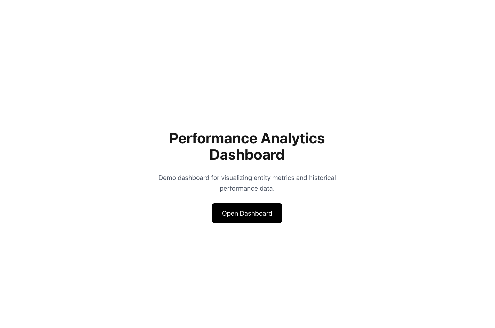
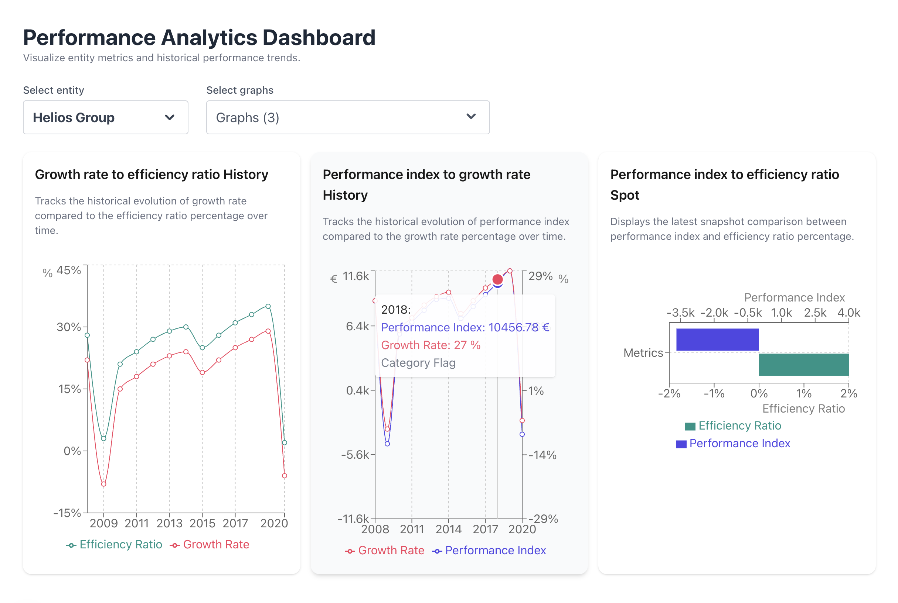
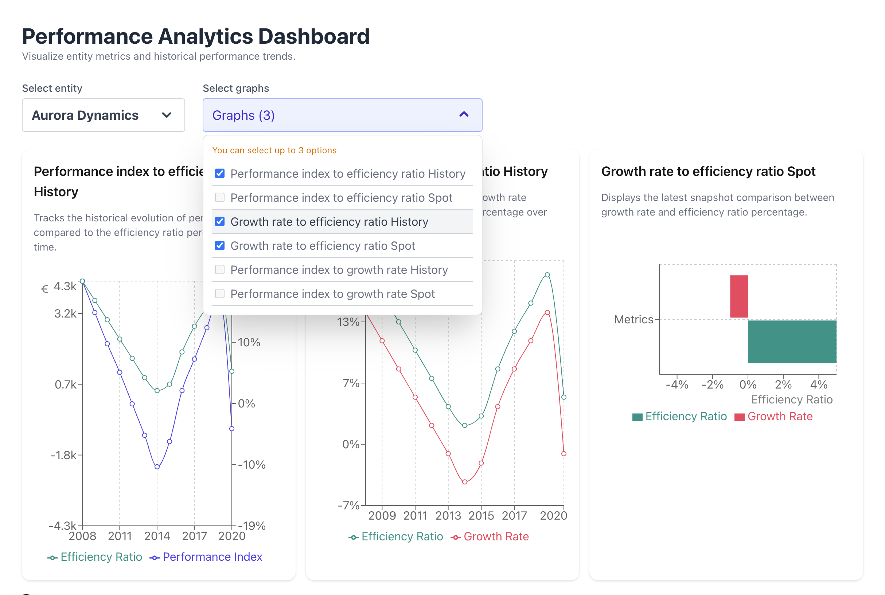
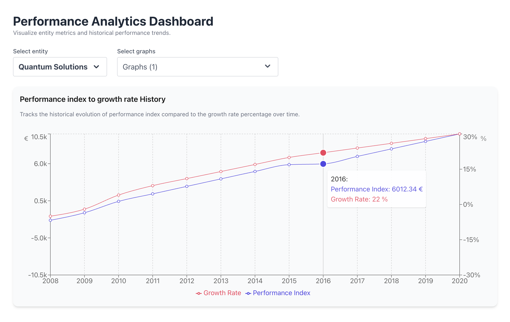

# Performance Analytics Dashboard

Performance analytics dashboard built with modern React tools to visualize entity metrics and historical performance data.


## Stack

This is a [Next.js](https://nextjs.org) project bootstrapped with [`create-next-app`](https://nextjs.org/docs/app/api-reference/cli/create-next-app).

- Next.js
- React
- TypeScript
- TailwindCSS
- TanStack Query
- Recharts

## Features

- Select entities to visualize their metrics
- Choose multiple graphs (up to 3)
- Display spot metrics and historical trends
- Async data fetching with TanStack Query

## Key concepts

- Feature-based architecture
- Data fetching with TanStack Query
- Dynamic chart rendering
- Component composition

## Architecture

### Project Structure

The project follows a **feature-based architecture** to keep business logic, UI, and shared utilities well organized.

```bash
app/
├─ page.tsx # Landing page
└─ dashboard/page.tsx # Dashboard page

features/
└─ dashboard/
├─ components/ # Dashboard-specific UI components
├─ hooks/ # Custom hooks (state, data logic)
└─ config/ # Graph definitions and configuration

shared/
├─ api/ # API client and data fetching logic
├─ components/ # Reusable UI components
├─ providers/ # Global providers (TanStack Query)
└─ utils/ # Shared utility functions
```

### Architecture Principles

- **Feature-based structure**: business logic related to a feature lives in the same module.
- **Shared layer**: reusable utilities and providers are centralized.
- **Separation of concerns**: UI, hooks, and configuration are clearly separated.

## Run locally

```bash
npm install
npm run dev
```

Open [http://localhost:3000](http://localhost:3000) with your browser to see the result.

## Screenshots

Landing Page:



Dashboard Three Graphs View:



Dashboard Dropdown View:



Dashboard One Graph View:


